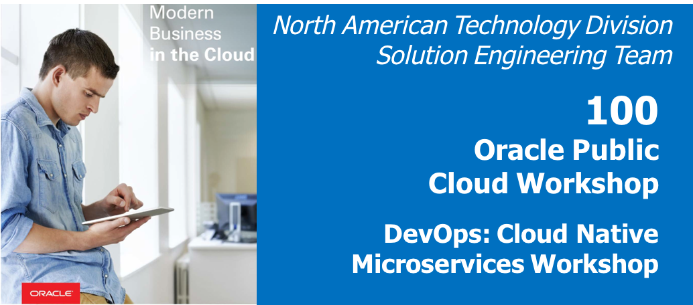
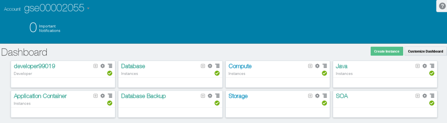
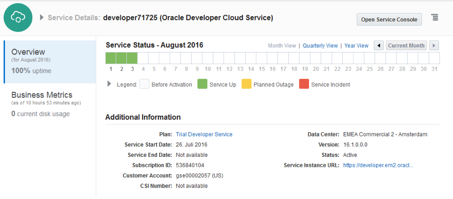
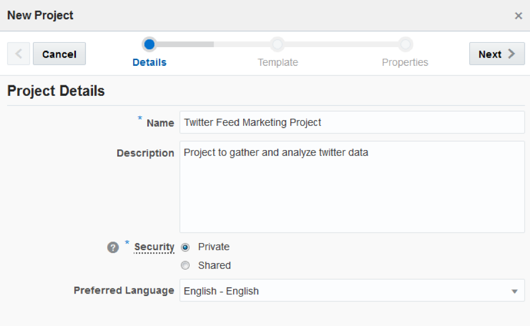
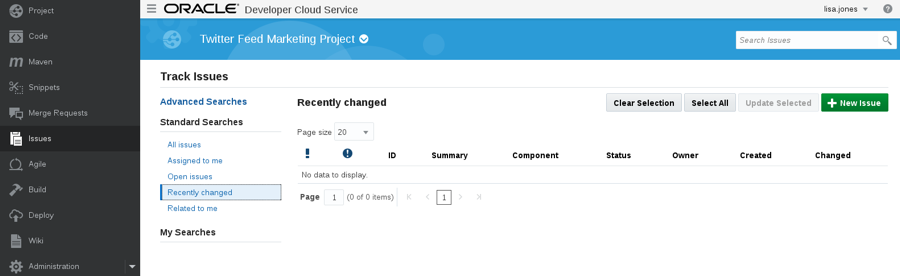

  
Update: March 31, 2017

## 前書き

これは、**Oracle Cloud Native Microservicesワークショップ**の一部であるいくつかのラボの最初のものです。このワークショップでは、いくつかのマイクロサービスを作成して使用するクラウド・ネイティブ・プロジェクトのソフトウェア開発ライフサイクル（SDLC）を紹介します。

あなたは1人のユーザーとしてログインしますが、ワークショップでは3人のペルソナが必要です。**プロジェクト・マネージャ・ペルソナ**は、プロジェクトを作成する上で作業するためのタスクや機能の追加、および開発者にタスクを割り当てます。プロジェクトマネージャーは、最初のスプリントを開始します。**Java開発者ペルソナ**は、Twitterデータの取得とフィルタリングを可能にする新しいTwitterフィードサービスを開発します。**JavaScriptの開発者のペルソナ**は、分析を可能にするためにTwitterのデータを表示する新しいTwitterのマーケティングのUIを開発します。このワークショップでは、Oracle Developer Cloud ServiceおよびOracle Application Container Cloud Serviceにアクセスする予定です。

***問題を記録するには***、ここをクリックして [github oracle](https://github.com/oracle/cloud-native-devops-workshop/issues/new) リポジトリの問題提出フォームにアクセスしてください。

## 目標
- 初期プロジェクトを作成する
    - プロジェクトにユーザーを追加する
- 製品の問題を作成する
    - Twitterフィード・マイクロサービスの問題を作成する
    - Twitterフィード・マーケティングUIの問題を作成する
- アジャイルボードと初期スプリントを作成する
- スプリントに問題を追加する

## 必要な成果物
- 次のラボでは、インストラクターが提供するOracle Public Cloudアカウントが必要です。

# Twitterフィード・マーケティング・プロジェクトを作成する

## 開発者向けクラウド・サービス・プロジェクトの作成

### **ステップ1**: Oracle Cloudアカウントにログインします。
- どのブラウザからでも構わないので、次のURLにアクセスします:
    `https://cloud.oracle.com`

- ブラウザの右上にある **サインイン** をクリックします

    

- **重要** - マイサービスでは、ドロップダウンリストから正しいデータセンターを選択し、**My Services**をクリックします。どのデータセンターを選択するか不明な場合には、対面式のトレーニング・イベントですので、ドロップダウン・リストからどの**リージョン**を選択するか***インストラクタに確認してください***。Oracle Trialを使用してアカウントを受け取った場合は、試用確認メールに地域を事前に選択するURLが記載されています。

    

- アイデンティティ・ドメインを入力し、**Go**をクリックします。

    

- アイデンティティ・ドメインが設定されたら、ユーザー名とパスワードを入力して「**サインイン**」をクリックします。

  **メモ:** このラボでは、プロジェクト・マネージャ、***Lisa Jones***の役割を引き受けます。Lisa Jonesのアイデンティティを前提としていますが、インストラクタから提供された**ユーザー名**か、会社から与えられた**ユーザー名**、またはOracle Trialの一部としてお客様に提供された**ユーザー名**を使用してアカウントにログインします。ワークショップを進めていくうちに、あなたは1人のユーザーとしてログインしたままになりますが、プロジェクト・マネージャーのLisa Jonesから他のペルソナへの「論理ユーザー」の変更もなされます。

    

    

- このアカウントで利用できるさまざまなクラウドサービスを表示するダッシュボードが表示されます。

    

- **[ダッシュボードのカスタマイズ]**を**クリック**して、サービスをダッシュボードに追加します。**[Show]**を選択すると、サービスが追加されます。このワークショップでは、**Application Container、Developer、Storage**のクラウドサービスを確実に表示する必要があります。

    

### **ステップ2**: オプションのストレージ複製ポリシーのチェック/設定

***次のいずれかが当てはまる場合は、この手順をスキップします。***

- あなたはOracleスポンサーイベントに参加しており、**インストラクターはあなたにアカウントを提供しました**。これらのアカウントにはすでにポリシーが設定されています。

- **個人用の試用アカウント**にサインアップし、既に試用ポリシーを設定している**試用アカウント生徒用ガイド**を完了した。

***上記に該当しない場合***は、次の手順に従ってストレージ複製ポリシーを設定する必要があります。

- **Storage**クラウド・サービスをクリックします

    

- 画面上部の**Open Service Console**アイコンをクリックします

    

- 後続のダイアログが表示された場合、レプリケーション・ポリシーは変更できないため、その設定には注意が必要です。デフォルトを選択し、**[Set Policy]**ボタンをクリックします。メッセージが表示されない場合、レプリケーション・ポリシーはすでに設定されており、使用するクラウド・アカウントはワークショップの準備ができています。

    

- ブラウザの[戻る]ボタンをクリックし、**[Dashboard]**ボタンをクリックしてメインダッシュボードに戻ります。

    

### **ステップ3**: Developer Cloud Serviceにログインする

Oracle Developer Cloud Serviceは、チーム開発プロセスを合理化し、ソフトウェアのデプロイを自動化する完全な開発プラットフォームを提供します。統合プラットフォームには、問題追跡システム、アジャイル開発ダッシュボード、コードのバージョン管理とレビュー・プラットフォーム、継続的な統合と配信の自動化、およびWikiやライブ・アクティビティ・ストリームなどのチーム・コラボレーション機能が含まれます。豊富なWebベースのダッシュボードと一般的な開発ツールとの統合により、Oracle Developer Cloud Serviceはより優れたアプリケーションをより迅速に提供します。

- クラウドUIダッシュボードから、**Developer**サービスをクリックします。この例では、Developer Cloud Serviceの名前は**developer99019**です。
    

- [Service Details]ページでは、サービスの状態の概要をすばやく確認できます。

    

- Oracle Developer Cloud Serviceの**Open Service Console**をクリックします。サービス・コンソールには、現在メンバーとなっているすべてのプロジェクトが一覧表示されます。

    

### **ステップ4**: Developer Cloud Serviceのプロジェクトを作成する

- [ **New Project** ]をクリックして、プロジェクト作成ウィザードを開始します。

    

- 詳細画面で以下のデータを入力し、**Next**をクリックします。

    **Name:** `Twitter Feed Marketing Project`

    **Description:** `Project to gather and analyze twitter data`

    **メモ:** Privateプロジェクトはあなただけが見ることができます。Sharedプロジェクトは、すべてのDeveloper Cloudユーザーに表示されます。いずれの場合でも、プロジェクトと対話するためには、プロジェクトにユーザーを追加する必要があります。

    

- デフォルトのテンプレートを[**Empty Project*]に設定したままにして、[ **Next** ]をクリックします。

    

- **Wiki Markup**プリファレンスを**MARKDOWN**に設定し、[ **Finish** ]をクリックします。

    

- プロジェクトの作成には約1分かかります。

    

- これで、ソフトウェア開発を管理できる新しいプロジェクトができました。

    

# 製品のissueを作成する

## Twitterフィード・マイクロサービスのissueを作成する

### **ステップ5**: 初期GITリポジトリ作成のissueを作成する

このステップでは、まだプロジェクト・マネージャ、**Lisa Jones**のアイデンティティを引き継いでいます。

- 左側のナビゲーションパネルで[ **Issues** ]をクリックすると、Track Issuesページが表示されます。

    

- [ **New Issue** ]をクリックします。[新しい問題]ページに次のデータを入力し、[ **Create Issue** ]をクリックします。

    **メモ:** このハンズオン・ラボでは、問題の「物理的な」所有者として自分のアカウントを割り当てますが、このワークショップのために、**Bala Gupta**は次の問題の「論理的な」所有者になります。

    

    **Summary:**
    `Create Initial GIT Repository for Twitter Feed Service`

    **Description:**
    `Create Initial GIT Repository for Twitter Feed Service`

    **Type:** `Task`

    **Owner:** `Select your account provided in the dropdown [Logical Owner = Bala Gupta]`

    **Story Points:** `1`

    メモ: ストーリー・ポイントは、Scrumチームが使用する任意の尺度です。ストーリーを実装するのに必要な労力を測定するために使用されます。この[サイト](https://agilefaq.wordpress.com/2007/11/13/what-is-a-story-point/) に、より詳細な情報が記載されています。

    

### **ステップ6**: Twitter資格情報の更新のissueを作成する

- **New Issue**をクリックします。[New Issue]ページに次のデータを入力し、[ **Create Issue** ]をクリックします。

    

    **Summary:** `Create Filter on Twitter Feed`

    **Description:** `Create Filter to allow user to supply text to reduce the amount of data returned by the Twitter feed`

    **Type:** `Feature`

    **Owner:** `Select your account provided in the dropdown [Logical Owner: Bala Gupta]`

    **Story Points:** `2`

    

### **ステップ7**: 初期GITリポジトリ作成のissueを作成する

- [ **New Issue** ]をクリックします。[ New Issue ]ページに次のデータを入力し、[ **Create Issue** ]をクリックします。メモ：次の2つのissueは、論理的にJohn Dunbarが所有します。

    

    **Summary:** `Create Initial GIT Repository for Twitter Feed Marketing UI`

    **Description:** `Create Initial GIT Repository for Twitter Feed Marketing UI`

    **Type:** `Task`

    **Owner:** `Select your account provided in the dropdown [Logical Owner: John Dunbar]`

    **Story Points:** `1`

    

### **ステップ8**: Twitterフィードを表示するためのissueを作成する

- [ **New Issue** ]をクリックします。[New Issue]ページに次のデータを入力し、[ **Create Issue** ]をクリックします。

    

    **Summary:** `Display Twitter Feed in Table Format`

    **Description:** `Display Twitter Feed in Table Format`

    **Type:** `Feature`

    **Owner:** `Select account provided in the dropdown [Logical Owner: John Dunbar]`

    **Story Points:** `2`

    

- ウィンドウの**左側**にある戻る矢印  をクリックするか、[ **Issues** ] メニュー・オプションをクリックして、新しく作成されたすべてのissueを表示します。

    

# アジャイルボードの作成

## アジャイルボードと初期スプリントを作成する

### Developer Cloud Serviceのアジャイルページの概要

Oracle Developer Cloud ServiceでAgileメソドロジを使用する前に、Agileページの次の主要コンポーネントを理解することが重要です。

- **Board** – ボードは、プロジェクトのissueを表示および更新するために使用されます。ボードを作成するときは、それをIssue Queryに関連付けます。ボードは、クエリによって返されたissueを表示します。チームメンバーが作成したボードを使用することも、独自のボードを作成することもできます。好きなだけ多くのボードを作ることができます。
- **Sprint** – スプリントは、チームメンバーが製品コンポーネントを実装しようとする短い期間（通常、1週間または2週間）です。製品コンポーネントに関連するissueをSprintに追加します。製品コンポーネントの作業を開始すると、関連するSprintを起動（またはアクティブ化）します。スプリントを使用してissueを更新するには、まずスプリントをアクティブにし、アクティブ・スプリント・ビューにスプリントを追加する必要があります。
- **Backlog view** – ボードのクエリによって返されたすべてのissueを一覧表示します。このビューには、ボードのアクティブおよび非アクティブのすべてのスプリントと、ボードのクエリに一致するissueを含む他のボードのスプリントも表示されます。各Sprintには、追加されたissueが一覧表示されます。バックログ・セクション（バックログページの最後のセクション）には、まだスプリントに属していない未解決のissueがすべて一覧表示されます。バックログビューには解決されたissueとクローズされたissueは表示されません。
- **Active Sprints view** – ボードのすべてのアクティブなスプリントを一覧表示し、ステータスをドラッグ＆ドロップするだけでissueステータスを更新することができます。
- **Reports view** – [Burndown Chart]タブを選択してSprintに残す作業量を表示するか、[Sprint Report]タブを使用してSprintの開かれたissueおよび完了した問題を一覧表示します。

### **ステップ9**: アジャイルボードを作成する

- 左サイドメニューの**Agile**をクリックすると、既存のボードをすべて一覧表示するページが表示されます

    

- [ **New Board** ]をクリックし、以下のデータを入力します。完了したら、[ **Create** ]をクリックします。

  **Name:** `Microservices`

  **Estimation:** `Story Points`

    

### **ステップ10**: スプリントを作成する
- 最初のスプリントを作ってみます。[ **New Sprint** ]をクリックします。次のデータを入力し、[ **OK** ]をクリックします。

    **Name:** `Sprint 1 - Initial Development`

    **Story Points:** `6`

    

### **ステップ11**:	バックログのissueをスプリントに追加する

- 次に、新たに作成されたスプリントにバックログの問題を追加します。**Sprint 1**セクションに**4つのissue**を一度に1つずつ**ドラッグ＆ドロップ**します。これにより、問題がスプリントに追加されます。

    

    

## アジャイルボードのカスタマイズ

### **ステップ12**: ボードをカスタマイズする

次のステップでは、アジャイルボードをカスタマイズし、新しい進捗状態を追加します。状態や条件についてのより詳細な情報が必要な場合には、この[リンク](http://www.oracle.com/webfolder/technetwork/tutorials/obe/cloud/developer/AgileDevelopment/AgileDevelopment.html)に、チュートリアルがあります。

- ここでは、ボードのカスタマイズ方法を紹介します。右側で、[ **Board** ] → [ **Configure** ]をクリックします。

    

  **メモ**: 新しい進捗状態を作成する前に、新しい状態で使用されるいくつかの条件の割り当てを解除する必要があります。新しい条件を追加したり条件を削除することはできませんが、プロジェクトのニーズに合わせて進捗状況を再定義したり、ある状態から別の状態に条件を移行したりすることができます。Completed状態には、デフォルトで多数の条件が割り当てられています。

- [ **Progress States** ]して、[ **Completed** ]状態をクリックします。ウィンドウの左下のパネルでは、条件を下にスクロールし、すべての**RESOLVED条件**を選択します。 をクリックして、割り当てられていない条件パネルに移動しますI。

    

- [ **New Progress State** ]をクリックします。[ **Name** ]を[ **Verify Code** ]に変更します。QAとテストを実行するためにこの新しい状態を使用します。

    

- **RESOLVED**の未解決の条件をすべて強調表示し、をクリックして条件列に移動します。

    

- [ **Verify Code** ]が強調表示されているので、をクリックして [ **Verify Code** ]を上の完了済みプロセス状態に移動します。これは、タスクが進行する順序を決定するため、重要なステップです。  

    

- [ **Save** ]をクリックして変更を維持します。

    

### **ステップ13**: スプリントを開始する

- [ **Start Sprint** ]ボタンをクリックします。

- デフォルトのままにして、[ **Start** ]をクリックします。

    

- [ **Active Sprints** ]をクリックして、スプリントダッシュボードを表示します。

    

- [ **Reports** ]ボタンをクリックして、バーンダウンとスプリントのレポートを表示します。

    

- これで、次のラボに移動する準備が整いました
