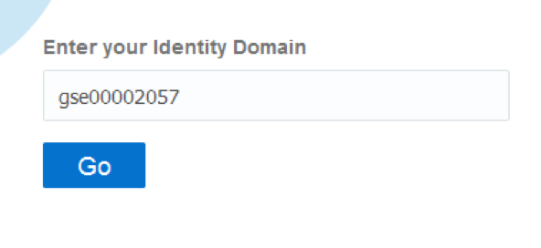
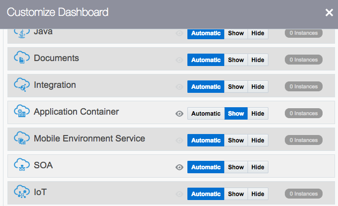
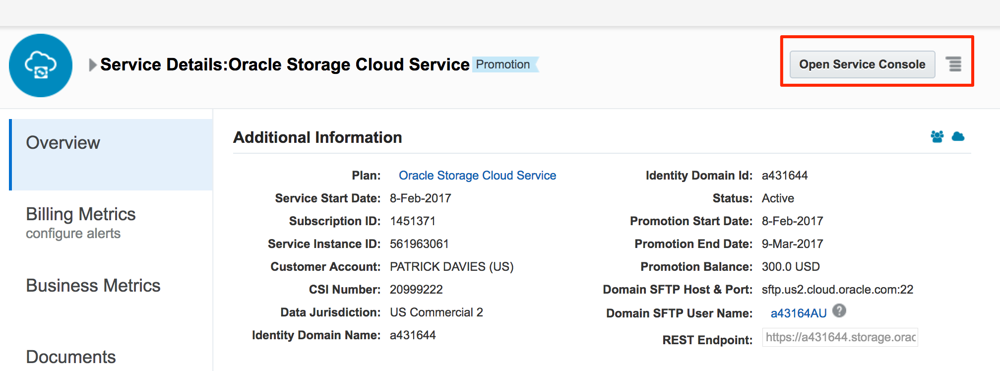
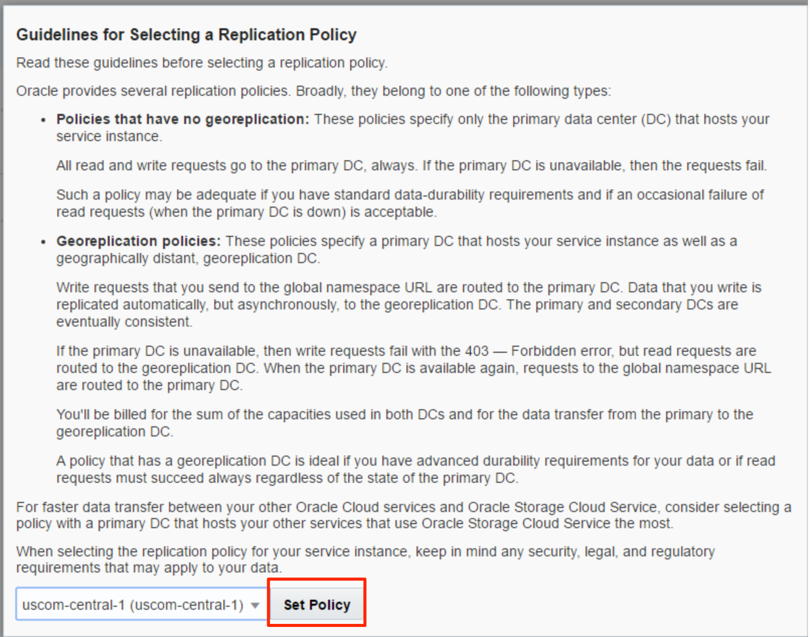
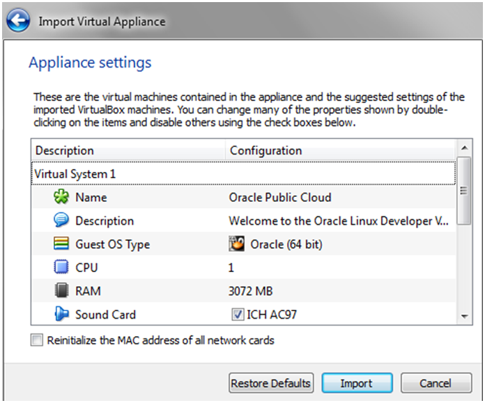

  
Update: January 28, 2017

## ハンズオンセットアップガイド

このハンズオンセットアップガイドではハンズオンで使用するOracle Cloud環境の取得手順、クライアント環境の設定手順を説明します。このハンズオンではOracleが提供するCloudサービスである[**Oracle Developer Cloud Service**](https://cloud.oracle.com/ja_JP/developer_service), [**Oracle Application Container Cloud Service**](https://cloud.oracle.com/ja_JP/acc)に加えてEclipse, Maven, Git, Bracket等のOSSを使用します。

**ハンズオン参加者の方は事前に下記Step1,2を完了させてください。環境の準備が整っていない場合、ハンズオンに参加していただけない可能性があります。**

## Step1. Oracleクラウド環境の設定

### トライアルアカウントの取得
[**こちら**](https://shop.oracle.com/r/promo?sc=codeny_hol2_cloudpromotion)からトライアルアカウントを取得します。

### ストレージレプリケーションポリシーの設定

#### Oracleクラウドアカウントへログイン
1. 右記リンクからOracleクラウドホームページへ移動します。:`https://cloud.oracle.com`
1. 右上の**Sigin In**をクリックします。

    

1. アカウント作成時に割り当てられたData Centerを選択し、**My Services** をクリックします。Data Centerの情報はトライアルアカウントの通知メールに記載があります。

    

1. Identity Domain名を入力し、**Go** をクリックします。**Identity Domain名, ユーザ名, パスワード** はトライアルアカウントの通知メールに記載があります。

    

1. Identity Domainがセットされたら、ユーザ名・パスワードを入力し、**Sign In** をクリックします。

    

1. ログインが成功すると、トライアルアカウントで使用可能なクラウドサービスの一覧が表示されたダッシュボード画面へ移動します。

    

1. Storageクラウドサービスがダッシュボードで表示されていない場合、**Customize Dashboard**をクリックし、サービス名の横の**Show**を選択することでダッシュボードにサービスパネルが表示されます。このハンズオンでは**Application Container**と**Developer and Storage**を使用しますので、**Show** を選択し、ダッシュボードに表示されるようにしておきます。

    

#### ストレージレプリケーションポリシーの確認・設定

トライアルのデフォルトではストレージレプリケーションポリシーは設定されていないので、下記手順に従ってポリシーの設定を行います。

1. **Storage クラウドサービス** をクリックします。

    

1. 右上の**Open Service Console** をクリックします。

    

1. 下記の画面が表示されたら、デフォルト設定のまま**Set Policy** をクリックします。画面が表示されない場合、レプリケーションポリシーは既に設定されているので、追加の設定は必要ありません。

    

1. ストレージレプリケーションポリシーの設定が完了しました。

## Step2. クライアント環境の設定

クライアント環境の設定はハンズオン実施前までに完了させて置く必要があります。
下記の手順に従って、Virtual Boxをインストールし、ハンズオン用VMが起動する事を確認してください。

### Virtual Boxクライアント環境の設定

#### 前提条件要件
  - MAC or PC / Minumum of 50GB of free storage / 8GB RAM
  - Administrator権限
  - Virtual Boxの最新版がインストールされている 
    インストールされていない場合、[**こちら**](https://www.virtualbox.org/wiki/Downloads)からインストールを行ってください。

#### OVAファイルの入手
  1. [**こちら**](https://publicdocs-corp.documents.us2.oraclecloud.com/documents/link/LFF42D5B385ADB4324B055CBF6C3FF17C1177E4725F3/folder/FA853951DE14FED12E559568F6C3FF17C1177E4725F3/_VM)からOVAファイル(Virtual Boxのイメージファイル)をダウンロードします。
  1. ダウンロードしたファイルをunzipします。ファイルを結合する必要があるので、winzipや7zip等のツールを使用してください。

#### OVAファイルのインポート

1. **Oracle Virtual Box** を起動します。

    

1. 左上のメニューから**File -> Import Appliance** を選択します。

    

1. **browse** をクリックし、インポートするファイルを選択します。

1. unzipしたOVAファイルを選択し、**Open** をクリックします。

    

1. ファイルが選択されたら、**Next** をクリックします。

    

1. 設定はデフォルトのまま、**Import** をクリックします。

    

1. インポートが完了するのを待ちます。

    

#### Virtual Box Imageの起動

1. インポートが正常に完了すると、Virutal Boxの画面に**Oracle Public Cloud** が電源OFFの状態で表示されます。

1. **Oracle Public Cloud** を選択し、画面左上の**Start**をクリックします。

    

1. 数分でVirtual BoxのImageの起動が完了します。ハンズオンはこちらの環境を使用して進めて行きます。

    
